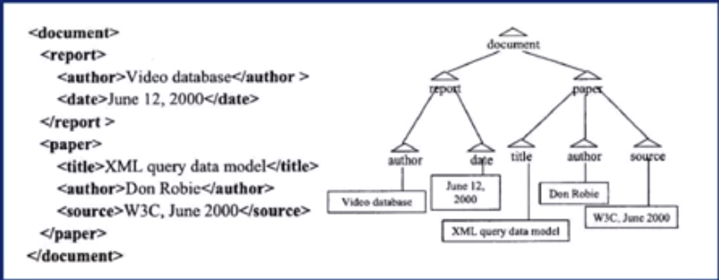

# Different kinds of data model
## 1. Relational Data model

> **Refer to Relational data model slides with this**

- Simplest and most frequently used.
- Basis for many traditional DBMS(Mysql, Oracle, etc).

1. Describe the structural components of a relational Data Model / What is a relational data model
   - Primary data structure - table (a.k.a relational table or relations)
   - Table represents a set of tuples(a.k.a relational tuple / row of the table / same as a record).
   - Each of **the elements** in a relational tuples are **atomic i.e. they represent 1 unit of information and cannot be decomposed any further.**
   - All the tuples in the relation must be unique or distinct (due to the definition of sets).
   - All the tuple must have the same structure in the same order.
   - The header of the table is the part of the **schema of the table**
   - Each column are the attributes (/schema) of the relation and they can tell the type, constraint along with the title(name of the attribute).
   - 
   - **Note about primary key**: It is used not only to determine that the values of this attribute must be unique but also, knowing the primary key, one can know all the corresponding values that the primary key tuple represents.
     - Ex: Knowing Employee ID 202 gives information of the entire tuple that ID 202 represents.
   - Foreign Key :
      - **Syntax**: (Foreign_Table).(Referencing_attribute) References (Primary_attribute).(Primary_column)
      - Ex: EmpSalaries.EmpID References Employees.ID
      - References - Means the values in Ref. table(EmpSalaries) exists only if the values in the table being referenced / Parent Table (Employees) exists.
      - Foreign Key (not a primary key) - EmpSalaries.EmpID
      - Primary Key - Employees.ID
   - Join operation
      - Common column represented once - called Natural Join, where all the other corresponding columns in the respective tables are connected / joined to each other in the new "JOINED table"
     - It is one of the most expensive operations, i.e. time and space consuming operations (especially for large analytical data, join becomes a bottleneck in such applications).
     - **Suitable data management platform makes the join operation efficient**
   - | Excel | Relational Model     |
     | :------------- | :------------- |
     | Non-atomic       | Atomic       |
     | The table is made into columns that may have overlapped values (eX: Minor <1 million)| Table made into subsequent attributes to provide flexibility in query matching|
     |This causes substring operation (Expensive operation)|Less expensive|
     |One to many relations can't be seperated into foreign and primary tables(Ex: Attack and attack types, weapon and weapon types)|seperated into corresponding tables|

## 2. Semistructured Data Model
> **No need to refer to slides for this**

- It is the data model behind the world wide web
- A semistructured data model can be explained using the following languages:
  1. HTML (HyperText Markup Language)
     - It has a smaller block which is embedded into a larger block.
     - There are multiple list items and paragraphs and any single document can have different number of them. Which implies that **while the data object has some structure, it is flexible**
     - 

  2. XML (Extended Markup Language)
     - Similar to HTML but the tags need not be already defined, instead it is user defined.
     - Different (to html) in the sense that they have different number of subelements called values.
     - Different from relational data models in that the query can be asked for both the schema and the data. (Relational model have query for schema and not data).
     - Example: What is the name of the element who has a sub-element whose textual content is a "CellType"? (sampleattribute and experimentalfactor are the elements)
     - 
       
  3. JSON (JAVASCRIPT OBJECT NOTATION)
    - USECASE: format for different data in Twitter and FB
    - Similar structure to HTML and XML with smaller block (Tuples) within larger block(list).
    - The tuple consists of key value pairs:
    - Key Value pairs: Atomic property name and their values.
    - 
- These different data structures can be generalized by modeling as trees:
#### Tree data Structure:
  - Values are written as textual content of an element. (Leaves of tree since they don't have any further items).
  - Ex:
    - 
  - **ADVANTAGE : DS that allows "NAVIGATIONAL ACCESS" of the data**
  - Ex:
    - Operations result for the node PAPER:
    | Operation | Result     |
    | :------------- | :------------- |
    | getParent  ->  | document      |
    | getChildren  ->  | title, author, source      |
    | getSibling  ->  | report      |-

    - Textual query like : "Which strings have the substring "data" ?" which gives the root to node path for the "data".
      - Ex:
      - For substring "Video Database"
        - Answer of root to node path:
          - document/report/author/Video Database
    - Query like: "Who is the author of XML query data model?"
      - Answer: Don Robie
      - How?
      - One of the evaluation scheme is to navigate:
        - textualnode -> title -> paper -> author -> textualNode(Don Robie)
        - direction reversed in paper cuz paper is the least common ancestor node of author node and the "XML QUERY DATA MODEL" node.

> **Hands on after this : refer to 2.3, 2.4, 2.5 -> This is sufficient**

> 2.3.Relational Data Model (census.csv) 
  - Filter to show the population in 2010 of the state california which is greater than 1000000 (1 million)
    
  - (Reset filter) Calculate the sum and average of 2010 population from rows 5-13
  - if you can do this.. no need to refer slide 2.3. 

>2.4. Semistructured Data Model (JSON) 
  - Refer to the slides 2.4.

> 2.5. Array Data model (Image)  
  - Refer to slides 2.5.

> 2.6. Sensor Data
  - Refer to slides 2.6.

> **Need not refer to the hands on of week 2 in the coursera page**
