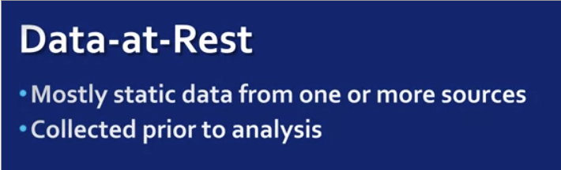

# Why is streaming data different?
**[Refer slides simultaneously]**
Objective: 1. ^
           2. Challenges of streaming data management and processing

- Data-at-rest vs Data-in-motion  

  - 

  - 

  - **Data-in-Motion has similar data collection method apply**
  - **Analysis of data addressed is batch processing and analysis of streaming data is stream processing**

- Data Processing Algorithms:
  - In terms of efficiency algorithm for each is different as one is determined by size while other is not:
  - 
  - Looping for one will end while not for the other.  

- Streaming Data Management and processing
  - Modeling and management of streaming data enable computations on one data element or a small window of recent data elements.
  - These computations can update metrics, monitor and plot satistics on the streaming data or apply analysis techniques to the streaming data to learn the dynamics of the system as a time series.
  - Benefits
  - **Relatively fast and simple computations**:
      - Since computations need to be completed in real time, the analysis tasks processing streaming data should be quicker or not much longer than the streaming rate of the data. Which we define by it's velocity.
  - **No interaction with the data source**
      - In most streaming systems, the management, and processing system subscribe to the data source, but doesn't send anything back to the stream source in terms of feedback or interactions.
  - These requirements for streaming data processing are quite different than batch processing where the analytical steps have access to often, all data and can take more time to complete a complex analytical task with less pressure on the completion time of individual data management and processing tasks.
- Most organizations use hybrid (or lambda) architecture for processing, streaming and back jobs at the same time.
- In these systems, streaming wheel over the real-time data is managed and kept until those data elements are pushed to a batch system and become available to access and process as batch data.
- In such systems, a stream storage layer is used to enable fast reads of streams and ensure data ordering and consistency.
- A processing layer for data is used to retrieve data from the storage layer, to analyze it, and most probably load it to a batch data stream and notify the streaming storage that the data set does no longer need to be in streaming storage.
- The big data challenges we discussed were scalability, data replication, and durability, and fault tolerance arise in this type of data very significantly.\
- Two main challenges that needs to be overcome **to avoid data loss, and enable real time analytical tasks.**
  - Size and frequency of the mean data can significantly change over time.
    - Unpredictable changes - can be periodic and occur in pattern or may be unpredictable and sporadic
    - Ex: streaming data found on social networks such as Facebook and Twitter can increase in volume during holidays, sports matches, or major news events.
  - Other changes include - dropping or missing data or no data during n/w or h/w problems

**Streaming data summary:**
  - Handled differently than static data.
    - Size-> unbounded
    - Size and Frequency -> Unpredictable
    - Processing -> Fast and simple
