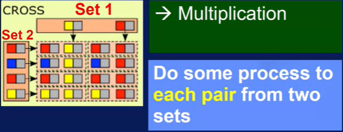
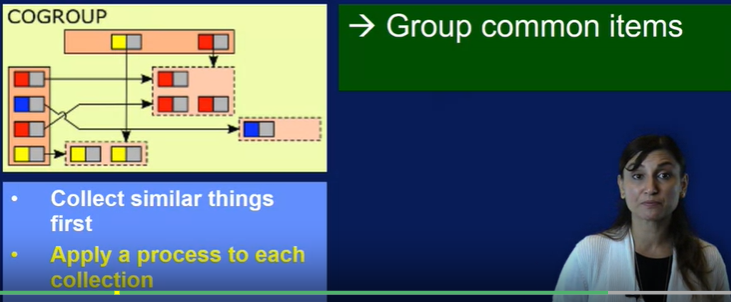
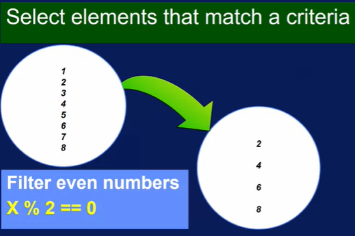

# Big data pipelines and high level operations for big data processing.
## 1. Processing pipelines
### Summary :

1. What dataflow means
2. It's role in data science.
3. Explain split->do->merge as a big data pipeline with examples,
4. Define the term data parallel.

Data Flow graphs: The various transformations which includes operations, that data undergoes, executing one after another as a pipeline is called dataflow graphs.

Understanding DataFlow:
- For example: HelloWorld MapReduce program:
            - Reads one or more text files and counts the number of occurences of each word in these text files.
            - Hence op: a text file with list of words and the number of occurences of the word in the files.
            - Description:  In this application,the files were first split into HDFS cluster nodes as partitions of
            the same file or multiple files. Then a map operation, in this case, a user defined function to count words
            was executed on each of these nodes. All the key values that were output from map were sorted
            based on the key. The key values with the same word were moved or shuffled to the same node.
            Finally, the reduce operation was executed on these nodes to add the values for key-value pairs with the
            same keys.
            - In short: 4 distinct steps : 1. Map 2. Reduce 3. Split 4. merge
            - Data Paralellism - every step of the pipeline.
            - batch Processing.
- Basic example of data parallel scalability which includes 3 steps (split-do-merge):
      - 1. Split - Partitioning of data - Parallelization over input. Data Granularity - line.
      - 2. Do something - Operations done on the split data (these can be **chained or differed**). For ex: Shuffle and sort -
        - parallelization of intermediate products - key-value pairs
      - 3. Merge - Result finally combined using merge or higher level order function - Reduce -  Parallelization to produce one output file.
      - This version is called _**Big data pipeline**_ (Pipe - output of one program is fed as input to another)
      - Data parallelism is achieved by running these data of seperate partitions through the same operation in multiple cores simultaneously.

- Data gets reduced to smaller step at each steps.
- Technique of batch processing applies to stream processing also.

##### Stream Processing example:
  - Simplified advance stream data from an online game:
    - 1. Your event gets ingested through a real time big data ingestion engine, like Kafka or Flume.
    - 2. They get passed into a Streaming Data Platform for processing like Samza, Storm or Spark streaming.
          - This allows for processing data one event at a time or chunking the data into Windows or Microbatches of time or other features. Any pipeline processing of data can be applied to the streaming data here(like done in batch processing).
    - 3. The process stream can then be served through a real-time view or a batch-processing view.
          - **Real-time view** is often subject to change as potentially delayed new data comes in.
            - The storage of the data can be accomplished using H-Base, Cassandra, HDFS, or many other persistent storage systems.

Hence,
##### Big Data Pipelines
- Created to process data through an aggregated set of steps that can be represented with the split- do-merge pattern with data parallel scalability.

## 2. Some High-Level Processing Operations in Big Data Pipelines
- Some common types of transformation of data:
  - Apply specific function (math)
  - Change format of data from one to another.
  - Join data with other datasets
  - Filter values out of data set.

> **All aggregations are transformations but vice versa not true.**
> **Some of these data transformations are referred to as data parallel patterns.**

### Summary:
  1. list common data transformations within big data pipelines
  2. design a conceptual data processing pipeline

##### Transformations
  - Higher order functions or tools to convert your data from
  one form to another
  - Most common - map operation
   
  - **MAP OPERATION**

    - Basic building blocks of big data pipeline.
    - Used when we need to apply a process to each member of a collection. (10% bonus to each person salary.) 

    - The image shows application of map function to data depicted in gray color.
    - the colors are key that identify each dataset.
    - **Each data set is executed seperately even for the same key**

  - **Reduce Operation**

    - Collecting of things that have the same key (applying a process to the datasets with the same key).

  - **Cross / Cartesian operation (All pairs)**
    - When having more than one key in a dataset that needs to interact with another dataset with multiple keys.
    - 
    - Hence we use cartesian product to share each data partition gets paired with all other data partition regardless of its key.
    - **Sometimes referred to as ALL PAIRS**

  - **Match / Join operation**

    - 
    - Similar to cross product but more selective in forming pairs.
    - For ex:
      - Operations team and sales team working on different products.
      - These teams interact with each other on the basis of common products.
      - Product - key and match operation mathes those team members with common key.
    - Only the keys in data with both sets gets joined.
    - Hence less costly than cartesian.

  - **Co-group operation**
    - 
    - For ex :  Operation and sales team having members with same product and all present in one room.

  - **Filter operation**
    - 
    - Only elements that pass a test are shown in the output.
    - For ex:
      - Select teams that have only even number of team members.

- **Using the correct operation gives better data parallelism.**

## 3. Aggregation
