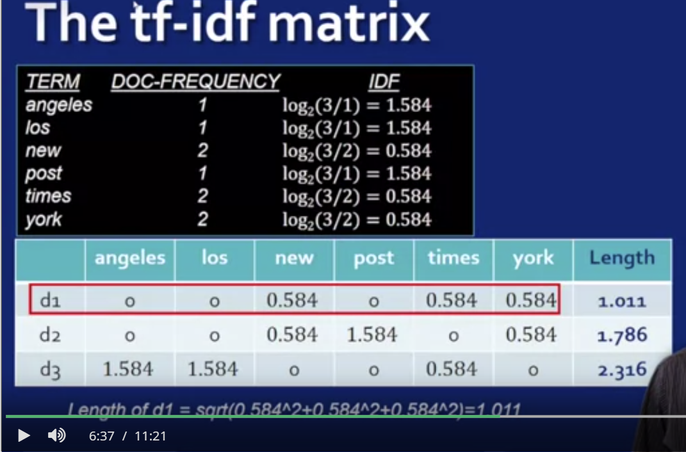
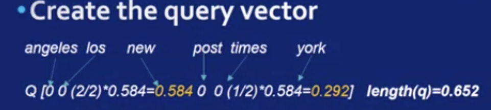
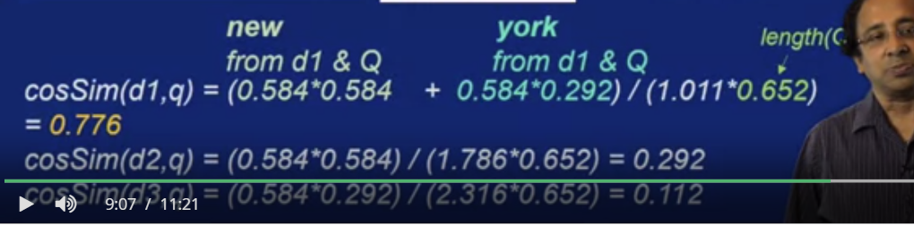
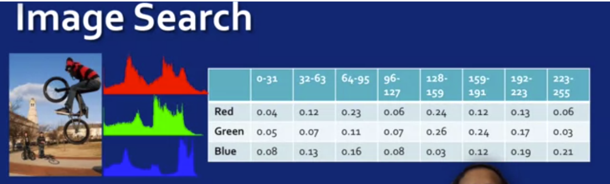
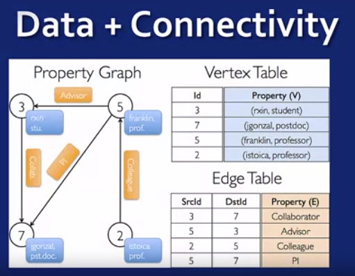
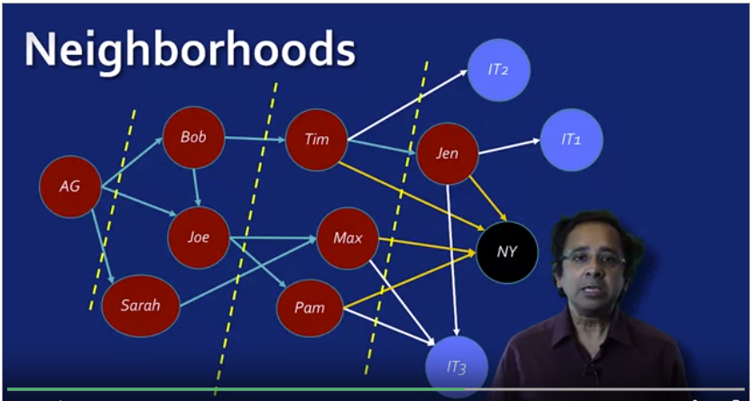
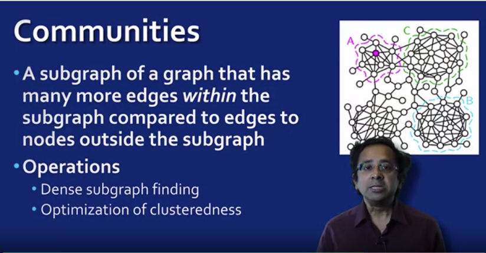
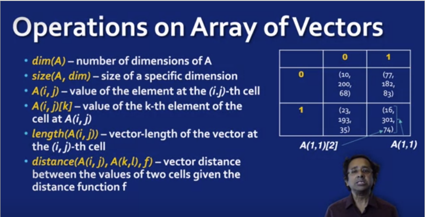

# 1. Vector Space Model
- Data model used for collection of text and images (both unstructured)
- Search engines use vector model.
- Ex:
  - Document vector
    - Term Frequency Matrix/Table:
      - Rows: Documents
      - Columns: words in documents
      - 
    - Inverse Document Frequency
      - It provides the importance of a term in a document.  
      -  
      - Note: **BASE DOESN'T MATTER**
    - IDF is a penalty factor for terms which are too widely used (but doesn't have that much of weightage EX: "The").
    - TF-IDF:
      - Termfrequency * Inverse Document Frequency  
      -   
    - **NOTE:** (Read this along with slide "Searching in Vector space")
    - Searching in Vector space:
      - Consider a query: new new york.
      - Objective: We need to compare the query and find how similar is a document with the query
        - 1. Calculate the max. freq. of a term in the query.
          - In this case, "new" has the frequency 2 and hence is the max in the query.
          - Hence the max freq term = 2
        - 2. Create the query Vector
          - Using the table of tf-idf Matrix each term's tfidf is multiplied by the number of occurences divided by the max occurence of any term in query vector.
          - i.e.:
            - for new(in query vector) tfidf is:
              - tfidf (from table) = 0.584
              - number of occurences = 2
              - max occurence of any term in query vector = 2
              - Hence :
          - 
          - Length calculated by calculating square root of the sum of the squares of each term as calculated.
        - 3. Measure similarity of query vector to document by determining how "far" the vector is from each document - USING SIMILARITY FUNCTION
          - Using Cosine function:
            - If vectors identical then similar as cos (theta) = 1
            - Other wise, the angle increases -> cos (angle) value decreases -> indicating the amount of dissimilarity of the query with the doc.
            - Simply **multiply the tfidf scores of the corresponding elements in the corresponding document**. i.e. angeles in d1 row of tfidf matrix(0) * angeles' tfidf score in table (0) = 0. (Similarly do for all terms)
            - **Then** **sum** each of these terms to get the **numerator** of cosine and divide with product of **length of terms in document** d1 and query vector.
            - 
            - Hence doc1 much more similar to query than other two.
            - **PS: Here the query for document 3 is new new times and not new new york as new and york terms have both tfidf score as 0. for 0.112 the query must be "new new times".**
      - **Note**: For control over ranking of the terms in tfidf, users perform QUERY TERM WEIGHTING
        - Refer slides:
          - Formula : Relative weight of term = Weight/Total weight
    - Similarity search is also used for images using a vector space model.
    - (Slides show scatter histogram as a feature from the image (Shown in left)).
    - Histogram is count of pixels having certain density value (X and y resp.)
    - Histogram can be thought as vector
    - The pixel values in the table have been normalized with the size of the image to make the rowsum equal to one.
    - Other possible vectors:
      - image texture, shape of objects, other properties.
      - Hence providing vector model for unstructured data.
    - 
# 2. Graph Data model
  - Ex: Social Network
  - Graph vs Other data models:
    - 1. Properties and attributes of entities and other relationships
    - 2. Connectivity structure that constitutes the network.
    - Ex:
      - Apache Spark System:
        - 
      - Note: The Edge Table and the vertex Table together is a form of the graph model called the **Property Graph Model**
  - **Representing Connectivity Information**
    - Traversal - edge following based on some conditions:
        - Ex: Figure below: IT1,IT2, IT3 - restaurants. AG wants to go to a restaurant with max. likes:
        - 
    - Class of Optimization operations:
      - Find shortest path between 2 nodes:
        - Best route from source to target location
      - Find an Optimal round-trip path that must include some specific nodes
        - Operation determines the order in which the nodes must be visited.
        - Application: Trip Planner
      - Find "best compromise" paths between 2 nodes:
        - Best path given 2 or more optimization which can't be satisfied simultaneously
          - Ex: Shortest distance from home to airport while minimizing the number of highway travels.
        - This is called a Pareto-optimality problem on graphs
    - Neibourhood of Node 'N' in graph
      - **Set of edges** that are directly connected to Node N in the graph
    - A 'k' neighborhood of 'N' is a collection of edges that are atmost k steps away from N
    - N

    - **Important Class of Analysis to perform with neighborhood is Community (a.k.a cluster) Finding:** 
      -   A community in a social network can be a close group of friends.
      - (Figure for def and operations)
      - 
      - **Higher density with a community and lower density across communities**
      - Hence, densely connected path of graphs can be used to find communities
    - Complex Operation includes:
      - Finding best community(cluster) in a graph so that any other grouping of nodes into communities would be less effective.
      - Bigger and denser graph -> operation harder to compute
    - **Hence neighborhood based optimization problems present significant scalability challenges**
    - Anomalous Neighborhoods - Neighborhoods different from all others
      > **Note : The following has all been considered for the red node**

      - Near Star:
        - Almost perfectly star shaped (too ideal doesn't happen in real)
        - i.e. the nodes that the red node is connected to are mostly unconnected among themselves.
      - Near Clique:
        - Clique refers to a neighborhood where each node is connected to **all** other nodes in the community.    
        - i.e. A significantly large amount of nodes are connected among themselves.
      - Heavy Vicinity:
        - Some edges have a unusually heavy weight than other edges
      - Predominant edge:
        - *1* Edge has a predominantly high weight compared to other edges
      - 

    - Connectedness Operations:
      - Connectedness is the **fundamental property** of a graph
      - Used to finding optimal paths:
        - in such cases the optimal path must be searched only **within** the subgraph (component) and not the entirety of the graph.
        - 
      - For large graphs there exists several parallelized techniques for detection of connected components. (Ex: Map reduce based technique)

# 3. Other Data Model:
  - 1. Array:
    - It is called an indexed structure
      - Ex: Array A indexed as A(3,2) (3 and 2 are row and column indexes)
        - 3 represents row (not the row number) and 2 represents Column (not the column number)
      - Number of index is defined by the array dimension:
      - The following is 2 indexed array structure
      
      - A k dimensional array can be represented as a k+1 dimensional table:
        - For ex:
        - The array in the figure can be represented in table as:
        - | Column Index | Row Index | value|
        | :------------- | :------------- | :-------|
          | 0  | 0  | 10 |
          | 0  | 1  | 23 |
          | 0  | 2  | 28 |
          | 0  | 3  | 93 |
          | 0  | 4  | 39 |
          ...

      - Arrays of vectors:
        - Arrays in which the values are vector
        - 
        - Application ex:
          - Images often have rgb channels per pixel
            - Images are vector valued arrays where each array cell has 3 column vector.
          - 2. Satellite images:
            - Similar but more channels based on the range of wavelength foro each channel.
        - Operations on array of vectors:
          - Can be vector operation, array operation or composite operation.
          - Note: Length of vector = square root of the sum of the squares of each value of the vector
          - Distance between 2 vectors can be euclidean (rms method) or cosine function and so on..
          - Another operation : Selection operation :
            - Ex: Which cell have 0th value greater than 25
            - Result: (0,1)
            - 

**HANDS ON AFTER THIS : WEEK 3**
