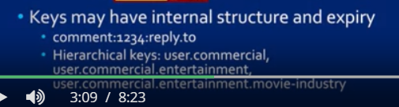

# BDMS Solutions:
[Refer to slides for diagrams of the products (redis,aerospike,etc.)]
  - Desired Characteristics of BDMS
    - 1. Flexible, semistructured data model
      - Flexible means - it should support both kinds of applications one that requires development of schema(traditional application) and those that don't require any schema as the data varies in attributes and relationships;
    - 2. It should support today's common "Big data types"
      - For ex:
        - Operations on text and docs. (Textual operation)
        - Social media that have time components are require temporal operations (before, after, during...)
        - It should allow spatial data (find all data within five mile radius of a landmark)
    - 3. A full query language
      - Difficult to learn but effectively manages large volumes of data where the query processor finds the most optimal way to retrieve data.
      - Must be atleast as powerful as SQL (relational systems).
    - 4. An efficient parallel query runtime
      - Must have parallel query engines which will run on multiple machines.
      - Architectures:
        - 1. Shared Nothing
                  - 2 machines don't share disk or memory
        - 2. Shared Memory
        - 3. Shared Cluster
      - This is a requirement for any BDMS regardless of how complete the supported query language is for efficiency sake
    - 5. Wide range of query sizes:
      -  Query sizes can change and BDMS must handle this also.
      - Some applications have small conditions & return small objects while other applciations (softwares/machine learning algos) have many conditions and return large objects.
      - A lot of information can choke the system.
    - 6. Continous data ingestion:
      - Stream ingestion
      - BDMS will have to deal with combining the streaming data with large historical data for better solutions (Example: streaming data from weather stations with historical data for prediction of wildfires)
    - 7. Scale Gracefully to manage and query large volumes of data
      - Use large clusters
      - BDMS must operate over a cluster and must handle failure
      - It must be able to handle new machines joining and existing machines leaving the cluster.
    - 8. Full data management capability
      - Ease of operational simplicity (install, restart configure, and provide high availability even when deployed across data centers that are distance apart).

  - Acid and BAse    
    - Acid properties are guaranteed by DBMS
    - Maintaining acid properties may lead to slow down of system due to too much data,updates and users and hence not ideal for BDMS to guarantee them.
    - BASE relaxes ACID:
      - Basic Availability
        - There will be a response to every request  
      - Soft State
        - State of system may change over time.
        - Even without input changes may occur in system due to eventual consistency.
        - Hence soft state.
      - Eventual Consistency
        - System will eventually become consistent once it stops recieving input.
        - After input stops, the data propogates to corresponding place in the system.
        - In reality this doesn't happen as input recieving doesnt stop.
        - Hence the data is defenitely propogated but not right away.
  - Theorical Results behind Relaxation:
    - CAP / Brewer's theorem:
      - He states, that it is impossible for a distributed computer system to simultaneously provide all three of the following guarantees.
        - Consistency. It means all nodes see the same data at any time.
        - Availability, which is a guarantee that every request receives a response about whether it succeeded or failed.
        - Partition Tolerance. Which means the system continues to operate despite arbitrary partitioning due to network failures.
      - most of the big data systems available today will adhere to these BASE properties although several modern systems do offer the stricter ACID properties, or at least several of them.
  - MARKETPLACE:
    - CASE STUDY:
    - Products in the big data landscape (Matt turk depiction) are categorized into those provided by no SQL, massively parallel databases, analytic systems, real time systems, and so forth.
    - In this lesson, we'll do a quick tour through a few of these products from different areas of this landscape.
    - In each case our **goal will to be assess what aspects of our ideal BDMS they cover, and whether they have obvious limitations**.
    - NOTE: NOt all features of a system is covered.

## Redis: An enhanced key-value store:
  - In-memory data structure store
    - Not a full blown dbms.
    - It can persist data on disks and does so to save its state but its intended use is to optimally use memory and memory based methods to make a number of common ds very fast for lots of users
    - Structures supported: Strings,hashes,lists,sets,sorted sets.
  -  Look-up Problem (Redis can be thought as this)
    - Case 1: (key:string,value:string)
      - For lookup we provide key and get the value back
      - Redis key specs:
        - string - can be binary - size limit 512MB bt internal limit is higher
        - Hence small images like in "Captcha" can be used as binary string keys and the text corresponding to the captcha image can be the value.
        - Keys may have internal structure and expiry
          - Ex: Product codes may have product family,manafacturing batch and actual product id together into one id.
          - Redis can delete an expired key and can call a function to generate a new key.
          - **Benefit of structured key is that it can encode a hierarchy to the structure**
            - i.e. A lookup for user.commercial.entertainment will **also** retrieve user.commercial.entertainment.movie-industry
            - Ex: twitter tweets:
              - 
    - Case 2: (key:string, value:list)
      - Complex case when value not atomic but a collection object (like list - ordered set)
      - userID: [tweetID1,tweetID2,...]
        - Twitter uses a timeline architecture wherein it takes a users specific ID and identifies all tweets of the user from cache.
        - These tweets are then populated by the content of the tweet and returned as result
        - List is long, but insertion and deletion takes constant time.
        - If tweet retweeted then Id is also added to the list of the first tweet.
      - For long list, ziplist is used that reduces the size of the list without changing the content.
        - They are little more complex for insertion and deletion operations.
        - Redis - open source, allowed twitter to make list of ziplists, which allowed constant time insertion and deletion operations while saving space.
      - Case 3:(key:string, value:attribute-value pairs)
        - Redis values can be hases which are essentially named containers of unique fields and their values
  - Redis & Scalability
    - Paritioning and Replication:
      - Horizontal scalability or scale out capabilites refer to the ability of a system to achieve scalability when number of machines it operates on is increased.
      - Redis allows data partitioning thru:
        - 1. Range partitioning
          - It takes numeric keys and breaks up the range of keys into bins
          - Each bin is assigned a machine.
        - 2. Hash partitioning
        - 
      - Replication
        - accomplished thru master-slave mode
        - Slaves have a copy of the content of the master node and can serve read queries.
        - Replication process is asynchronous i.e. slaves don't get replicated data, it locks them with each other
        - Replication process ensures that they are consistent with each other.
        - [Refer slide for image]
## Aerospike: A new Generation KV store
  - It calls itself a distributed nosql database and key value store.
  - Architected for the performance needs of webscale applicaitons.
  - [Refer to slide for diagram] - AEROSPIKE WHITEPAPER DIAGRAM
  - How is aerospike related to the ecosystem it is designed for?
    - The top layer shows several applications for real time consumer facing systems, such as travel recommendation systems, pricing engines used for stock market applications, real time decision systems that analyze data to figure out whether an investment should be done and so forth.
    - All these systems have the common need that large amt of data should be accessible to them at any point of time.
    - Aerospike can interoperate with hadoop based system(spark) or legacy database or real time data source.
    - Can exchange large volumes of data with any source and serve fast lookups and queries to the applications above(in the top layer)
    - Hence very high availability, robust and strong consistency needs.
  - AEROSPIKE HIGH LEVEL ARCHITECTURE DIAGRAM:
    - [Refer next slide]
    - Fast Path
          - left side of architectue
          - Client system processes transactions i.e. data managed in primary index i.e. key value store.
          - This index stays in memory for operational purposes.
          - The server also interacts with the storage layer for persistence.
          - Storage layer uses 3 kinds of storage system:
            - 1. In-memory with Dynamic RAm or DRAM
            - 2. A regular spinning disk
            - 3. SSD/Flash - Solid state device for fast loading of data when needed.
          - Aerospike has optimized its performace with SSD
          - SSD has greater read performance and a lil slower write perf than Hard disk.(2500Mbps read, 1500Mbps write)
          - Hence, both h/w and s/w allows fast performance, and the ssd rates will not hinder this even if the data is stored in the ssd cuz of the fast io transfer rates.
          - Aerospike has secondary index which is also a point of uniqueness(apart from primary).
            - It makes a secondary index non primary key(unique tuples but not primary key)
            - Stored in main memory
            - Built on every node in a cluster and co-located with primary index.
            - Each secondary index contains references to records which are local to the node.
      - Querying AEROSPIKE:
        - Data types:
          - Standard scalar, lists, maps(hash in redis - contains attribute value pairs), **geospatial** (because it supports real time web applciation hence allows this. Ex: latitude, longitude values, regency polygon), large objects, strings, integer
          -  KV Store operation:
            - GeoSpatial queries like point-in-polygon
              - Is location of vehicle in India (which is a point-in-polygon query)
              - Distance query - find hotels in 3 miles of my location
              - KV queries are constructed programatically.
          - It has its own language - AQL : an SQL -like language.
            - Ex: Select name,age from users.profiles.
            - Allows seleciton, projection and aggregate funcitons.
      - Transactions in AEROSPIKE
        - Provides ACID guarantees.
          - Common technique used to balance large scale database management and transaction management in a cluster where nodes can join or leave.
          - Consistency (Apart from ensuring the constraints are satisfied) - all copies of data item in a cluster are in sync (Meaning applied to distributed systems)
          - Uses synchronous write to replicas
            - Synchronous write means the write process will be considered successful only if the replica is also updated.
            - No other write is allowed on the record while the update is pending
            - What happens if ingestion rate is increased and hence increasing write operation?
              - Aerospike relaxes immediate consistency by bypassing some of these consistency checks.
              - But if this is done eventual consistency will still be enforced.
            - Mechanisms to relax immediate consistency
          - Durability (permanency of the commited transaction even if system crashes):
            - Achieved by storing data in flash/ssd of every node and performing direct reads from the flash.
            - Maintained by replication of data so that even if one node fails the latest copy of the last data is available in one or more replica nodes in the same cluster, and nodes residing in remote clusters.
          - Aerospike avoids CAP theorem (and doesn't go against it) by:
            - making sure that the master knows exactly where all the other nodes are. And the replication is happening properly even when the new nodes are joining the network.
            - This is possible since, the CAP theorem holds when the network is partitioned.
            - i.e. when nodes in different parts of the network have different data content.
            - Hence, network partition reduced because of tighter cluster control.

## Semistructured Data - AsterixDB [Refer Slides with this]
  - Incubated by apache
  - Full fledged BDMS hence provides ACID guarantees("????? DOUBT -  Earlier he said DBMS provides ACID guarantees and now he says BDMS provides -- is ASTERIXDB BDMS OR DBMS?? -- maybe DB BDMS")
  - Basic Design
    - First slide shows JSOn and the next shows its schema in ASterixDB
    - Dataverse - namespace for data
    - Data is declared in terms of data types. The top type, which looks like a standard data with stable declaration, represents the user portion of the JSON object that we highlighted before.
    - The type below represents the message.
    - Now, instead of nesting it like JSON. The user attribute highlighted in blue is declared to have the type TwitterUserType, thus it captures the hierarchical structure of JSON.
    - We should also notice that the first type is declared as open - It means that the actual data can have more attributes than specified here.
    - In contrast, the TweetMessage type is declared as closed, meaning that the data instance must have the same attributes as in the schema.
    - AsterixDB can handle spatial data as given by the point data types shown in green.
    - The question mark at the end of the point type says that this attribute is optional. That means all instances need not have it.
    - Finally, the create dataset actually asks the system to create a dataset called TweetMessages, whose type is the just declared TweetMessage type.
  - AsterixDB which runs on HDFS provides several options for query SUPPORT:
    - 1. Own query language(AsterixQL) which resembles the XML query language.
      - It is a natively supported query language
      - [Refer to slide]
      - This particular query asks for all user objects from the dataset TwitterUsers in descending order of their follower count and in alphabetical order of the user's preferred language.
      - query processing engine can process queries in multiple languages.
      - For its supported language they've developed a way to transfer the query into a set of low level operations like select and join which their query exchange can support. Further, they've determined how a record described in one of these languages can be transformed into an Asterix. In this manner, they support hive queries, which is expressed in HIVEQL like:
      - Xquery,
      - Hadoop map reduce,
      - as wall as a new language called SQL++ which extends SQL for JSON.
      - Designed to operate on a cluster of machines.
        - Basic idea:
          - Partition data parallelism:
            - Each data set is divided into instances of various types which can be decomposed to different machines by either range partitioning or hash partitioning like we discussed earlier.
          - A runtime distributed execution engine called Hyracks is used for partitioned parallel execution of query plans.
          - For example, let's assume we have two relations, customers and orders, as you can see here.
          - Our query is find the number of orders for every market segment that the customers belong to.
          - Now this query need a join operation between the two relations, using the O_CUSTKEY as a foreign key of customer into orders.
          - It also needs a grouping operation, which for each market segment will pull together all the orders which will then be counted.
          - You don't have to understand the details of this diagram at this point. We just want to point out that the different parts of the query that are being marked, the customer filed here has two partitions that reside on two nodes, NC one and NC two respectively.
          - The orders file also has two partitions. But each partition is dually replicated.
          - One can be accessed either of nodes NC3 or NC2 and the other on NC1 and NC5.
          - Hyracks will also break up the query into a number of jobs and then fill it out which tasks can be performed in parallel and which ones must be executed stage by stage.
          - This whole thing will be managed by the cluster controller.
          - The cluster controller is also responsible for replanning and reexecuting of a job if there is a failure.
    - Supports Accessing real time data from external data sources at multiple rates:
      - one way, is files from directory Path
      - Consider the example of tweets.
      - As you have seen with the hands-on demo, usually people acquire tweets by accessing data through an api that twitter provides. Very typically a certain volume of tweets, lets say for every 5 minutes, is accumulated into a .json file in a specific directory. The next 5 minutes, in another .json file, and so forth.
      - The way to get this data into asterisks DB, is to first create an empty data set called Tweets here.
      - The next task is to create a feed.
      - That is an externally resource. One has to specify that it's coming from the local file system called local fs here and the location of the directory, the format and the data type it's going to copy it.
      - Next, the feed is connected to the data set and the system starts reading unread files from the directory.
      - Another way for AsteriskDB to access external data is directly from an API, such as the Twitter API. To do this, one would create a dataset as before. But this time the data feed is not on the local file system.
      - Instead it uses the push Twitter method which invokes the Twitter client with the four authentication parameters required by the API.
      - Once the feed is defined it is connected to the data set as before.

## Solr: Managing Text [Refer Video]
## Relational Data - Vertica [Refer Video]
